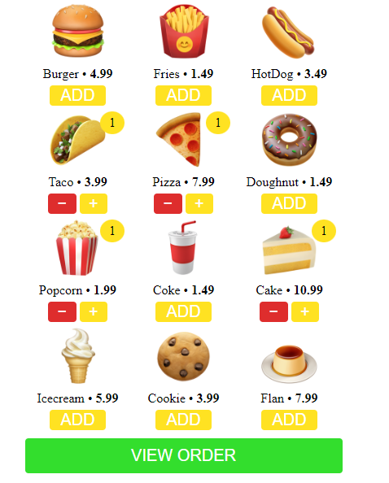
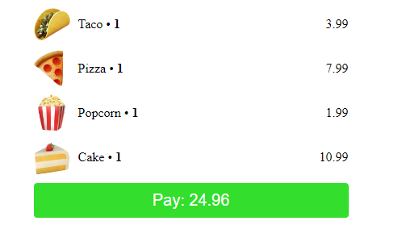

# DURGER KING
👨‍🏫É UMA PLATAFORMA DE PEDIDO INTERATIVA QUE PERMITE ADICIONAR E VISUALIZAR ITENS DE UM CARDÁPIO, IDEAL PARA UMA INTEGRAÇÃO COM TELEGRAM.

  
  

## DESCRIÇÃO:
Este site é uma aplicação simples de um menu de restaurante (fictício, chamado "DURGER KING") que permite ao usuário selecionar itens de um cardápio e ver um resumo do pedido. Ele utiliza HTML, CSS e JavaScript para criar uma interface interativa.

- Ao acessar o site, o usuário vê um menu com itens como "Burger", "Fries", "HotDog", entre outros. Cada item tem um preço e uma imagem correspondente.
- O usuário pode adicionar itens ao pedido clicando em "ADD". Isso atualiza o número de itens e revela botões para aumentar ou diminuir a quantidade de cada produto.
- Quando pelo menos um item é adicionado, o botão "VIEW ORDER" aparece. Clicando nele, o usuário pode ver um resumo de todos os itens adicionados, com o total de cada item, suas quantidades e o valor total do pedido.
- Um botão "Pay" (Pagar) aparece no final do resumo, permitindo que o pedido seja enviado.
- Essa aplicação também está integrada com o WebApp do Telegram, então o pedido final é enviado ao bot do Telegram quando o botão de pagamento é clicado.

- O site tem um layout simples e centralizado, otimizado para telas menores (como dispositivos móveis) com uma largura máxima de 390px.
- Os botões e cores são personalizados para dar um visual limpo e intuitivo. O amarelo é usado para destacar as ações, enquanto o verde e o vermelho são usados para confirmar e remover itens do pedido.

## EXECUTANDO O PROJETO:
1. **Visualização do Menu**:
   - Ao acessar o site, você verá uma lista de itens de comida, cada um com uma imagem, nome e preço.

2. **Adicionando Itens ao Pedido**:
   - Para adicionar um item ao seu pedido, clique no botão "ADD" abaixo de qualquer produto.
   - Após clicar em "ADD", aparecerão três botões: 
     - Um botão "-" para diminuir a quantidade.
     - Um botão "+" para aumentar a quantidade.
     - O item será contabilizado e o número correspondente será exibido.

3. **Visualizando o Pedido**:
   - Assim que você adicionar pelo menos um item, o botão "VIEW ORDER" será exibido.
   - Clique em "VIEW ORDER" para ver um resumo do pedido, com o nome dos produtos, quantidade e o total a pagar.

4. **Finalizando o Pedido**:
   - Na tela de resumo, após revisar os itens, o botão "Pay" aparecerá com o valor total.
   - Ao clicar em "Pay", os dados do pedido são enviados (possivelmente para um bot do Telegram, caso esteja conectado).

5. **Alterando o Pedido**:
   - Se quiser alterar o pedido antes de finalizar, você pode clicar no botão "+" ou "-" para ajustar as quantidades ou remover itens do pedido.

## SUBSIDIOS:
### INTRODUÇÃO:
Em **31/12/2023**, o Telegram lançou uma atualização que permite integrar sites diretamente com bots através de Mini-Apps. Este projeto pode ser usado como um exemplo prático para integrar seu bot com um site.

A configuração é simples:
1. **Hospede o site** em um servidor de sua escolha.
2. **Configure o bot** enviando o link do seu site nas opções do seu bot no [BotFather](https://t.me/BotFather) utilizando o comando `/newapp`.

Para mais detalhes e um guia completo, consulte o [CURSO DE TELEBOT](https://github.com/VILHALVA/TELEBOT).

### MAIS LINKS:
- [VIA CDN](https://telegram.org/js/telegram-web-app.js)
- [ATUALIZAÇÃO DO TELEGRAM](https://telegram.org/blog/calls-and-bots/pt-br?ln=a)
- [DURGER KING BOT](https://t.me/DurgerKingBot)

## NÃO SABE?
- Entendemos que para manipular arquivos em `HTML`, `CSS` e outras linguagens relacionadas, é necessário possuir conhecimento nessas áreas. Para auxiliar nesse aprendizado, oferecemos cursos gratuitos disponíveis:
* [CURSO DE HTML E CSS](https://github.com/VILHALVA/CURSO-DE-HTML-E-CSS)
* [CURSO DE JAVASCRIPT](https://github.com/VILHALVA/CURSO-DE-JAVASCRIPT)
* [CONFIRA MAIS CURSOS](https://github.com/VILHALVA?tab=repositories&q=+topic:CURSO)

## CREDITOS:
- [PROJETO CRIADO PELO "ShadowStep111"](https://github.com/ShadowStep111/Durger-King)
- [PROJETO EDITADO PELO VILHALVA](https://github.com/VILHALVA)

